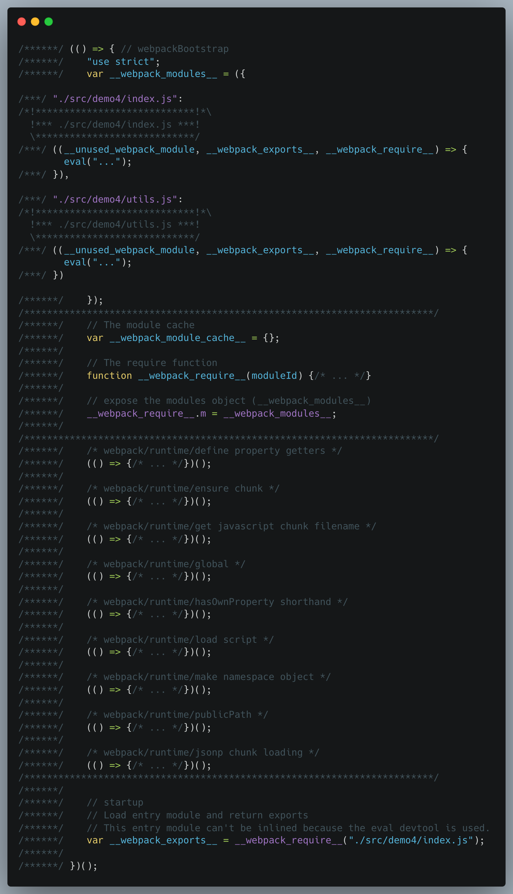
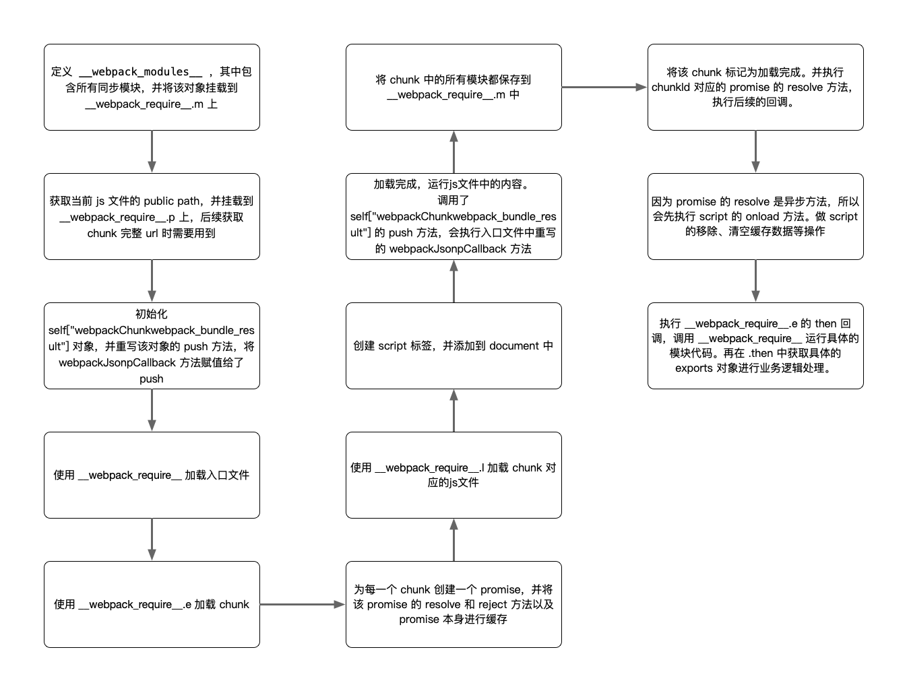

# webpack5 模块加载原理

## 前言

用一个简单的例子来了解一下 webpack 的异步加载原理。

## 环境准备

`webpack`: `5.89.0`

webpack.config.js

```javascript
module.exports = {
  entry: {
    demo4: "./src/demo4/index.js",
  },
  mode: "development",
};
```

构建命令

```json
{
  "scripts": {
    "build": "webpack --config webpack.config.js"
  }
}
```

### 示例代码

入口文件 `src/demo4/index.js`

```javascript
import utils from "./utils";
import { num } from "./utils";
console.log(num);
const result = utils.add(1, 2);
console.log(result);
// 异步加载
import("./data").then(({ asyncData }) => {
  console.log(asyncData);
});
```

同步加载模块 `src/demo4/utils.js`

```javascript
export const add = (x, y) => x + y;
export const num = 10;
export const obj = { a: { b: 1 } };

export default {
  add,
  num,
  obj,
};
```

异步加载模块 `src/demo4/data.js`

```javascript
export const asyncData = "异步加载";
```

[完整示例代码](https://github.com/GrayMind/webpack-bundle-result/tree/master/src/demo4)

### 构建结果

代码结构

整体结构是一个匿名的自执行函数。
从上往下包含以下几个部分：

1. `__webpack_modules__` 存放编译后的模块；
2. `__webpack_module_cache__` 模块缓存，加载过以后，下次再使用直接会从缓存中取；
3. `__webpack_require__` 模块的加载方法（核心方法）；
4. 将 `__webpack_modules__` 挂载到 `__webpack_require__.m` 对象上，后续异步加载流程中会用到；
5. 一系列 `webpack/runtime` 方法，这个到具体用到的时候再一一分析；
6. 模块加载的入口。

## 代码分析

### 前置工作-1

这些是部分 `webpack/runtime` 下的方法，先知道这些方法的作用，有利于后面代码的阅读和理解。

#### `__webpack_require__.r`

标识为 ES 模块。
TODO: 扩展 `__esModule` 的作用 https://toyobayashi.github.io/2020/06/29/ESModule/

```javascript
/* webpack/runtime/make namespace object */
(() => {
  // define __esModule on exports
  __webpack_require__.r = (exports) => {
    if (typeof Symbol !== "undefined" && Symbol.toStringTag) {
      Object.defineProperty(exports, Symbol.toStringTag, { value: "Module" });
    }
    Object.defineProperty(exports, "__esModule", { value: true });
  };
})();
```

#### `__webpack_require__.o`

`hasOwnProperty` 的简写。

```javascript
/* webpack/runtime/hasOwnProperty shorthand */
(() => {
  __webpack_require__.o = (obj, prop) =>
    Object.prototype.hasOwnProperty.call(obj, prop);
})();
```

#### `__webpack_require__.d`

defineProperty https://developer.mozilla.org/zh-CN/docs/Web/JavaScript/Reference/Global_Objects/Object/defineProperty

为 exports 添加 getter 属性。

```javascript
__webpack_require__.d = (exports, definition) => {
  for (var key in definition) {
    if (
      __webpack_require__.o(definition, key) &&
      !__webpack_require__.o(exports, key)
    ) {
      Object.defineProperty(exports, key, {
        enumerable: true,
        get: definition[key],
      });
    }
  }
};
```

### 同步加载

```javascript
var __webpack_exports__ = __webpack_require__("./src/demo4/index.js");
```

```javascript
// 缓存
var __webpack_module_cache__ = {};

function __webpack_require__(moduleId) {
  // 1. 检查模块是否存在缓存，存在的话，直接返回模块的 exports 对象
  var cachedModule = __webpack_module_cache__[moduleId];
  if (cachedModule !== undefined) {
    return cachedModule.exports;
  }
  // 2. 创建新的模块对象，并将其放在缓存里
  var module = (__webpack_module_cache__[moduleId] = {
    exports: {},
  });
  // 3. 执行模块函数
  __webpack_modules__[moduleId](module, module.exports, __webpack_require__);
  // 4. 返回模块的 exports 对象
  return module.exports;
}
```

`__webpack_require__` 是同步加载模块的核心方法，它做了下面这些事情：

1. 根据 `moduleId` 检查模块是否存在缓存，若存在缓存，直接返回模块的 `exports` 对象；
2. 使用 `moduleId` 为 `key` 创建新的模块，并将其放在缓存里；
3. 根据 `moduleId`，从 `__webpack_modules__` 里获取对应的模块，然后执行对应模块的具体代码；
4. 返回模块的 `exports` 对象。

#### `__webpack_modules__`

为了方便阅读代码，我们将多余的注释进行删除，然后去除 `eval`， 并将内部的代码进行格式化。这样得到的 `__webpack_modules__` 如下：

```javascript
var __webpack_modules__ = {
  "./src/demo4/index.js": (
    __unused_webpack_module,
    __webpack_exports__,
    __webpack_require__
  ) => {
    // 为 export 添加 __esModule 属性
    __webpack_require__.r(__webpack_exports__);
    // 同步加载 "./src/demo4/utils.js"
    var _utils__WEBPACK_IMPORTED_MODULE_0__ = __webpack_require__(
      "./src/demo4/utils.js"
    );
    console.log(_utils__WEBPACK_IMPORTED_MODULE_0__.num);
    const result = _utils__WEBPACK_IMPORTED_MODULE_0__["default"].add(1, 2);
    console.log(result);
    // 异步加载 src_demo4_data_js
    __webpack_require__
      .e("src_demo4_data_js")
      .then(
        // chunk异步加载完成后，加载chunk中包含的模块
        __webpack_require__.bind(__webpack_require__, "./src/demo4/data.js")
      )
      .then(({ asyncData }) => {
        console.log(asyncData);
      });
  },

  "./src/demo4/utils.js": (
    __unused_webpack_module,
    __webpack_exports__,
    __webpack_require__
  ) => {
    __webpack_require__.r(__webpack_exports__);
    __webpack_require__.d(__webpack_exports__, {
      add: () => add,
      default: () => __WEBPACK_DEFAULT_EXPORT__,
      num: () => num,
      obj: () => obj,
    });
    const add = (x, y) => x + y;
    const num = 10;
    const obj = { a: { b: 1 } };
    const __WEBPACK_DEFAULT_EXPORT__ = {
      add,
      num,
      obj,
    };
  },
};
```

`__webpack_modules__` 对象，`key` 为 `moduleId`，使用的是文件路径，`value` 是一个函数，包含参数:

1. `__unused_webpack_module`： 没有使用
2. `__webpack_exports__`： 在 `__webpack_require__` 中定义的模块的 `exports` 对象
3. `__webpack_require__`： `__webpack_require__` 同名方法

### 异步加载

在构建时，除了构建出一个 `demo4.js` 外，还构建出一个 `src_demo4_data_js.js` `chunk` 文件，这个文件是需要异步加载的。

```javascript
__webpack_require__
  .e("src_demo4_data_js")
  .then(__webpack_require__.bind(__webpack_require__, "./src/demo4/data.js"))
  .then(({ asyncData }) => {
    console.log(asyncData);
  });
```

#### chunk 内容

我们先看下 `src_demo4_data_js.js` 文件的内容。这是删除注释以及去除 `eval` 并格式化后的代码。

主要是调用了 `self["webpackChunkwebpack_bundle_result"]` 的 `push` 方法。

```javascript
"use strict";
(self["webpackChunkwebpack_bundle_result"] =
  self["webpackChunkwebpack_bundle_result"] || []).push([
  ["src_demo4_data_js"],
  {
    "./src/demo4/data.js": (
      __unused_webpack_module,
      __webpack_exports__,
      __webpack_require__
    ) => {
      __webpack_require__.r(__webpack_exports__);
      __webpack_require__.d(__webpack_exports__, {
        asyncData: () => asyncData,
      });
      const asyncData = "异步加载";
    },
  },
```

#### `__webpack_require__.e`

```javascript
/* webpack/runtime/ensure chunk */
(() => {
  __webpack_require__.f = {};
  // This file contains only the entry chunk. (此文件仅包含入口 chunk)
  // The chunk loading function for additional chunks (这个 chunk 加载函数是为了加载附加 chunk)
  __webpack_require__.e = (chunkId) => {
    return Promise.all(
      // 这个示例里只会执行 __webpack_require__.f.j 这一个方法，所以 promises 数组里只会有一个元素
      Object.keys(__webpack_require__.f).reduce((promises, key) => {
        __webpack_require__.f[key](chunkId, promises);
        return promises;
      }, [])
    );
  };
})();
```

#### `__webpack_require__.g`

[获取全局变量](https://developer.mozilla.org/zh-CN/docs/Web/JavaScript/Reference/Global_Objects/globalThis)

```javascript
/* webpack/runtime/global */
(() => {
  __webpack_require__.g = (function () {
    if (typeof globalThis === "object") return globalThis;
    try {
      return this || new Function("return this")();
    } catch (e) {
      if (typeof window === "object") return window;
    }
  })();
})();
```

#### `__webpack_require__.p`

```javascript
/* webpack/runtime/publicPath */
(() => {
  var scriptUrl;
  if (__webpack_require__.g.importScripts)
    // web worker，直接从 location 中取
    scriptUrl = __webpack_require__.g.location + "";
  var document = __webpack_require__.g.document;
  if (!scriptUrl && document) {
    // 从当前正在运行的脚本所属的 `<script>` 元素中获取
    if (document.currentScript) scriptUrl = document.currentScript.src;
    // 都没有获取到，从html的script标签中获取
    if (!scriptUrl) {
      var scripts = document.getElementsByTagName("script");
      if (scripts.length) {
        var i = scripts.length - 1;
        while (i > -1 && !scriptUrl) scriptUrl = scripts[i--].src;
      }
    }
  }

  if (!scriptUrl)
    throw new Error("Automatic publicPath is not supported in this browser");
  scriptUrl = scriptUrl
    .replace(/#.*$/, "")
    .replace(/\?.*$/, "")
    .replace(/\/[^\/]+$/, "/");
  __webpack_require__.p = scriptUrl;
})();
```

获取文件路径：

1. `web worker` 环境，从 `location` 中获取，[importScripts](https://developer.mozilla.org/zh-CN/docs/Web/API/WorkerGlobalScope/importScripts) 只有在 `web worker` 中存在
2. [document.currentScript](https://developer.mozilla.org/zh-CN/docs/Web/API/Document/currentScript) 当前正在运行的脚本所属的 `<script>` 元素, 获取标签的地址
3. 获取所有的 `script` 标签，然后从最后一个标签一次获取标签的 `src`，直到获取到为止
4. 都没有获取到，直接报错
5. 获取到以后，移除标签后的最后一级的文件路径，得到真实的资源公共路径。

比如：从 `http://127.0.0.1:8000/dist/demo4.js` 改为 `http://127.0.0.1:8000/dist/`

#### 加载 script

```javascript
/* webpack/runtime/load script */
(() => {
  var inProgress = {};
  var dataWebpackPrefix = "webpack-bundle-result:";
  // loadScript function to load a script via script tag
  __webpack_require__.l = (url, done, key, chunkId) => {
    // 如果正在处理的任务中存在该url，则直接将回调方法进行保存
    if (inProgress[url]) {
      inProgress[url].push(done);
      return;
    }
    var script, needAttach;
    if (key !== undefined) {
      // 判断该模块是否已经将js文件添加到 html 中的 script 标签中了
      var scripts = document.getElementsByTagName("script");
      for (var i = 0; i < scripts.length; i++) {
        var s = scripts[i];
        if (
          s.getAttribute("src") == url ||
          s.getAttribute("data-webpack") == dataWebpackPrefix + key
        ) {
          script = s;
          break;
        }
      }
    }

    if (!script) {
      // 还没有被加进去，创建 script 标签，并标记为需要添加到 document 上
      needAttach = true;
      script = document.createElement("script");
      // 省略部分代码 ...
      script.setAttribute("data-webpack", dataWebpackPrefix + key);
      script.src = url;
    }
    // 回调添加进 inProgress 中
    inProgress[url] = [done];
    var onScriptComplete = (prev, event) => {
      // 省略部分代码 ...
      // 清除超时定时器
      clearTimeout(timeout);
      var doneFns = inProgress[url];
      // 清空回调
      delete inProgress[url];
      // 移除 script 标签
      script.parentNode && script.parentNode.removeChild(script);
      // 运行该标签对应的回调(成功/失败/超时)
      doneFns && doneFns.forEach((fn) => fn(event));
      // 执行原始的script.onload 等方法
      if (prev) return prev(event);
    };
    var timeout = setTimeout(
      // 添加标签加载超时回调
      onScriptComplete.bind(null, undefined, {
        type: "timeout",
        target: script,
      }),
      120000
    );
    // 添加标签加载成功/失败回调
    script.onerror = onScriptComplete.bind(null, script.onerror);
    script.onload = onScriptComplete.bind(null, script.onload);
    // 将标签添加到 document 中
    needAttach && document.head.appendChild(script);
  };
})();
```

这里我们需要注意一个执行顺序的问题：script 标签中外部 js 加载完成后，会自动执行其中的代码，外部 js 文件中的同步代码执行完成以后，才会触发 script 的 onload 事件。

#### chunk 加载

```javascript
/* webpack/runtime/jsonp chunk loading */
(() => {
  // 存储 chunk 加载状态 (object to store loaded and loading chunks)
  // undefined = 没有加载(chunk not loaded), null = 预加载(chunk preloaded/prefetched)
  // [resolve, reject, Promise] = 正在加载(chunk loading), 0 = 加载完成(chunk loaded)
  var installedChunks = {
    demo4: 0, // 同步加载的 demo4.js，已经加载完成
  };

  __webpack_require__.f.j = (chunkId, promises) => {
    // 获取 chunk 的加载状态
    var installedChunkData = __webpack_require__.o(installedChunks, chunkId)
      ? installedChunks[chunkId]
      : undefined;

    // chunk 未加载完成
    if (installedChunkData !== 0) {
      // installedChunkData 存在真值，说明它是一个 promise，表示 chunk 正在加载。
      if (installedChunkData) {
        // 说明在其他地方也加载了同一个 chunk
        promises.push(installedChunkData[2]);
      } else {
        if (true) {
          // 每一个 chunk 对应一个 Promise 对象
          var promise = new Promise(
            (resolve, reject) =>
              (installedChunkData = installedChunks[chunkId] =
                [resolve, reject])
          );
          // 将 promise 的 resolve 、 reject 及本身都缓存在 installedChunks 中。
          promises.push((installedChunkData[2] = promise));

          // 开始加载 chunk
          // 获取 chunk 完整 url。http://127.0.0.1:8000/dist/src_demo4_data_js.js
          // __webpack_require__.u 只是在 chunkId 后面拼接上 .js
          var url = __webpack_require__.p + __webpack_require__.u(chunkId);
          // create error before stack unwound to get useful stacktrace later
          var error = new Error();
          var loadingEnded = (event) => {
            if (__webpack_require__.o(installedChunks, chunkId)) {
              installedChunkData = installedChunks[chunkId];
              if (installedChunkData !== 0)
                // 加载完成，清空 installedChunks 中的缓存信息
                installedChunks[chunkId] = undefined;
              if (installedChunkData) {
                // 省略 error 赋值逻辑
                // ...
                // 调用 reject
                installedChunkData[1](error);
              }
            }
          };
          // 使用jsonp的方式加载 chunk
          __webpack_require__.l(url, loadingEnded, "chunk-" + chunkId, chunkId);
        }
      }
    }
  };

  // install a JSONP callback for chunk loading
  var webpackJsonpCallback = (parentChunkLoadingFunction, data) => {
    var [chunkIds, moreModules, runtime] = data;
    // add "moreModules" to the modules object,
    // then flag all "chunkIds" as loaded and fire callback
    var moduleId,
      chunkId,
      i = 0;
    if (chunkIds.some((id) => installedChunks[id] !== 0)) {
      // 将 moreModules 中的模块都添加 __webpack_require__.m 中，也就是添加到 __webpack_modules__ 中
      for (moduleId in moreModules) {
        if (__webpack_require__.o(moreModules, moduleId)) {
          __webpack_require__.m[moduleId] = moreModules[moduleId];
        }
      }
      // 在该示例中没有使用到
      if (runtime) var result = runtime(__webpack_require__);
    }
    // 实际上调用的是 chunkLoadingGlobal 原始的 push 方法，将数据保存到 chunkLoadingGlobal 中
    if (parentChunkLoadingFunction) parentChunkLoadingFunction(data);
    for (; i < chunkIds.length; i++) {
      chunkId = chunkIds[i];
      if (
        __webpack_require__.o(installedChunks, chunkId) &&
        installedChunks[chunkId]
      ) {
        installedChunks[chunkId][0](); // 调用 resolve
      }
      installedChunks[chunkId] = 0; // 标记 chunk 安装完成
    }
  };

  // 获取全局变量 webpackChunkwebpack_bundle_result
  var chunkLoadingGlobal = (self["webpackChunkwebpack_bundle_result"] =
    self["webpackChunkwebpack_bundle_result"] || []);
  // 可能是其他场景下，先加载了异步模块，需要在这里将模块添加到 __webpack_modules__ 中
  chunkLoadingGlobal.forEach(webpackJsonpCallback.bind(null, 0));
  // 重写 push 方法，在异步模块使用 push 方法时，会自动调用 webpackJsonpCallback 方法，将模块内容加载到 __webpack_modules__ 中
  chunkLoadingGlobal.push = webpackJsonpCallback.bind(
    null,
    chunkLoadingGlobal.push.bind(chunkLoadingGlobal)
  );
})();
```

#### 总结



## 后记

这里只是一部分

## 参考

[Webpack 动态导入原理](https://github.com/Vincent0700/learning-webpack/blob/master/docs/Webpack%E5%8A%A8%E6%80%81%E5%AF%BC%E5%85%A5%E5%8E%9F%E7%90%86.md)
[webpack 是如何实现动态导入的](https://juejin.cn/post/6844903888319954952)
